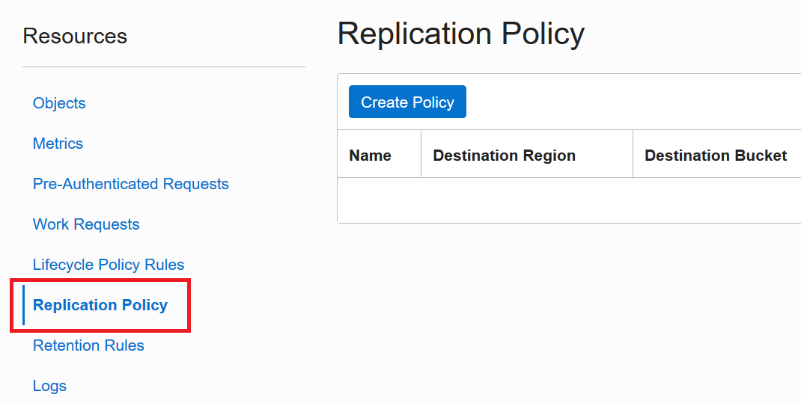

# Recreating and/or Replicating Object Storage

**Replication Documentation**: [Using Replication](https://docs.oracle.com/en-us/iaas/Content/Object/Tasks/usingreplication.htm#Using_Replication)

**Goal**: To recreate your Object Storage buckets _and_ objects from one region to another as well as establish object storage replication policies that will maintain multiple copies of data in your `primary` region to your `standby` region.


## Replication: Important Design Considerations
After the replication policy is created, the destination bucket is <mark>read-only</mark> and updated only by replication from the source bucket. Objects uploaded to the source bucket are automatically replicated to the destination bucket. Objects deleted from the source bucket are automatically deleted from the destination bucket. [[View Scope and Limitations of Replication]](https://docs.oracle.com/en-us/iaas/Content/Object/Tasks/usingreplication.htm#scopereplication)

For replication, the destination bucket cannot have Object versioning enabled. Please make sure object versioning is **disabled**.

## Preparation
Because Object Storage is a regional service, you must authorize the Object Storage service for each region carrying out replication on your behalf. For example, you might authorize the Object Storage service in region US East (Ashburn) to manage objects on your behalf. After you authorize the Object Storage service, you can replicate the objects in a bucket in US East (Ashburn) to a bucket in another region.

1. Grant required authorizing policies, more information about the following or alternative policies that are more restrictive, are found in: [Required IAM Policies](https://docs.oracle.com/en-us/iaas/Content/Object/Tasks/usingreplication.htm#permissions). Note that the second (2nd) policy pertains to a specific region service, `objectstorage-us-phoenix-1`. Replace `us-phoenix-1` if your Object Storage is in another region with the region's [identifier](https://docs.oracle.com/en-us/iaas/Content/General/Concepts/regions.htm#About).
    * > Allow group <my_group> to manage object-family in tenancy
    * > Allow service objectstorage-us-phoenix-1 to manage object-family in tenancy
2. Take note of the following necessary information:
    * the `Primary` buckets' name (we'll refer to as <PRIMARY_BUCKET_NAME> in this guide)


## Steps

For each Object Storage **bucket** resource that appears in your `object_storage.tf` file: 
1. You will find similar code-block(s) to the following Terraform code snippet. We will use this as a template to replicate different object storage buckets that exists in your primary region. 

    a. To do so, replace the following variables/text in your actual `object_storage.tf` where the placeholders are :
    * STANDBY_BUCKET_NAME_HERE
    * STANDBY_BUCKET_RESOURCE_1_NAME (keep unique)

    ```
    resource oci_objectstorage_bucket <STANDBY_BUCKET_RESOURCE_1_NAME> {
    #Required
    compartment_id = var.compartment_ocid
    name = <STANDBY_BUCKET_NAME_HERE> # must be unique
    namespace = data.oci_objectstorage_namespace.export_namespace.namespace

    #Optional
    access_type = var.bucket_access_type
    kms_key_id = oci_kms_key.test_key.id # optional: OCID of Master Encryption key from KMS
    metadata = var.bucket_metadata
    object_events_enabled = "true"
    storage_tier = "Standard"
    retention_rules {
        display_name = var.retention_rule_display_name
        duration {
            #Required
            time_amount = var.retention_rule_duration_time_amount
            time_unit = var.retention_rule_duration_time_unit
        }
        time_rule_locked = var.retention_rule_time_rule_locked
        }
    versioning = "Disabled"

    /* Remove/Replace if the following tags only applies to your Primary environment
    defined_tags = {}
    freeform_tags = {}
    */
    }
    ```

    b. For replication, the destination bucket cannot have versioning enabled. Please make sure object versioning is **disabled**. If Object Versioning is "Suspended," update versioning to "disabled".

2. **If replication is a requirement or needed**: Create a policy-based replication between `primary` and `standby` region buckets. Add the following terraform code snippet to your `object_storage.tf` **for each bucket** you intend to re-create across-regions.

    For the following, make sure to replace:
    * <STANDBY_BUCKET_RESOURCE1_REPL_POLICY>
    * <PRIMARY_BUCKET_NAME>
    * <DEST_REGION_NAME_HERE>
    * <POLICY_DISPLAY_NAME>

    For the following, make sure to use the previous name given:
    * <STANDBY_BUCKET_RESOURCE_1_NAME>

    Note:
    * <POLICY_DISPLAY_NAME> must only use letters, numbers, dashes, underscores, and periods. Avoid entering confidential information.

    ```
    resource oci_objectstorage_replication_policy <STANDBY_BUCKET_RESOURCE1_REPL_POLICY HERE> {
    #Required
    provider = oci.<PRIMARY REGION ALIAS NAME FROM PROVIDER FILE>
    bucket = <PRIMARY_BUCKET_NAME>
    destination_bucket_name = oci_objectstorage_bucket.<STANDBY_BUCKET_RESOURCE_1_NAME>.name
    destination_region_name = <DEST_REGION_NAME_HERE>
    name = <POLICY_DISPLAY_NAME>
    namespace = data.oci_objectstorage_namespace.export_namespace.namespace
    } 
    ``` 
    ---

    ### After your `standby` Object Storage has been created:

    Alternatively, you can use the OCI console to create policies, you can navigate to your Object Storage Bucket in your `primary` region. Then select `Replication Policy` within the Bucket Details page.

    

    Then click `Create Policy` and fill out following:
    + Your Replication Policy Name
    + Desired Region (Selection)
    + Your Destination Bucket (in your Standby, the bucket must already exist after the Step 1 along with the other code has been executed)

    Then finally, click `Create`
    
    After the policy is created, Replication: Source is added to Bucket Information. Objects uploaded to the source bucket after policy creation are asynchronously replicated to the destination bucket.

---
For each Object Storage **object** resource that appears in your `object_storage.tf` file:
1. You will find a similar code-block like the one below for every object your Object Storage bucket has. These are the objects that currently exist in your `primary` environment Object Storage buckets. We will use these resources as a template to do a `cross-region copy` of all these objects from your `primary` region to your `standby` region.

    a. To do so, you will need to replace the following variable/text in your actual `object_storage.tf`:
    * <STANDBY_BUCKET_NAME> - (this can be oci_objectstorage_bucket.<STANDBY_BUCKET_RESOURCE_1_NAME>.name or the string-name of your `standby` bucket that corresponds to this object's bucket.)

    b. Note: Do **NOT** change or remove `content_md5`, `content_type` and `object` for your objects.

    ```
    resource oci_objectstorage_object export_object_storage_1 {
    #Required
    bucket = <STANDBY_BUCKET_NAME>
    content = var.object_content
    namespace = var.object_namespace
    object = var.object_object

    #Optional
    cache_control = var.object_cache_control
    content_disposition = var.object_content_disposition
    content_encoding = var.object_content_encoding
    content_language = var.object_content_language
    content_type = var.object_content_type
    delete_all_object_versions = var.object_delete_all_object_versions
    metadata = var.object_metadata
    storage_tier = var.object_storage_tier

    #Important
    source_uri_details {
        region = var.region
        namespace = var.object_namespace
        bucket = var.bucket_name
        object = var.object_object
        }
    }
    ```

    c. Add the following inside the `resource` object, as shown above: below the comment #Important. Replace the following:
    * <PRIMARY_REGION_STRING> - where your `primary` region is (e.g. uk-london-1, us-ashburn-1)
    * <OBJECT_STORAGE_NAMESPACE> - unique namespace of your object storage, simply copy the value defined before, where namespace = <OBJECT_STORAGE_NAMESPACE> (e.g data.oci_objectstorage_namespace.export_namespace.namespace)
    * <PRIMARY_BUCKET_NAME> - bucket name in your `primary` environment
    * <OBJECT_NAME> - name of object, this will be the string defined in: object = "<OBJECT_NAME>"
    ```
        source_uri_details {
            region = <PRIMARY_REGION_STRING>
            namespace = <OBJECT_STORAGE_NAMESPACE>
            bucket = <PRIMARY_BUCKET_NAME>
            object = <OBJECT_NAME>
        }
    ```