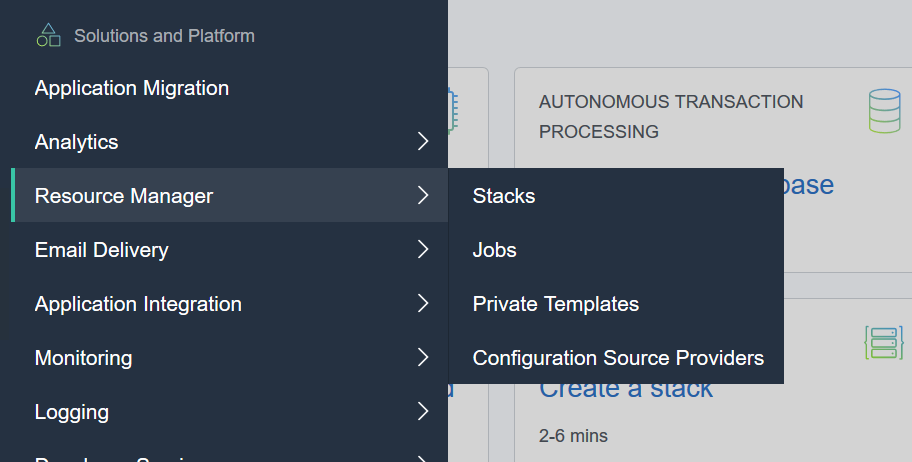
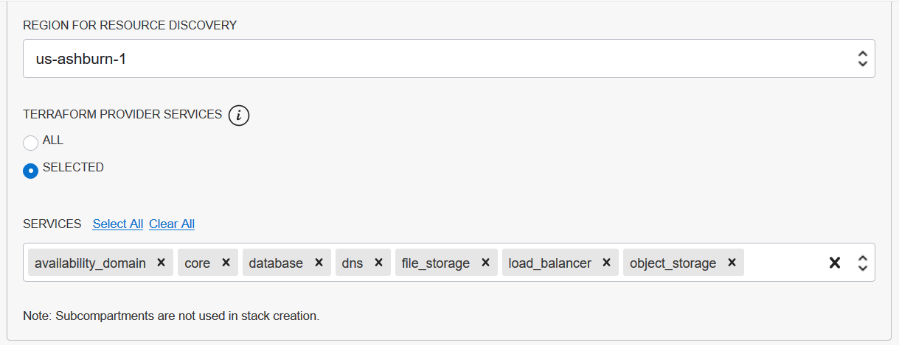
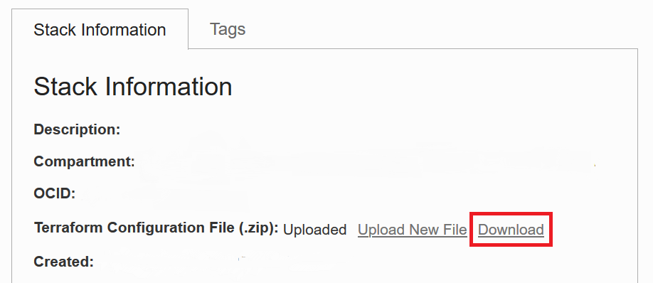

# Oracle Resource Manager(ORM): Discover Resources
**ORM Documentation**: [[Resource Manager]](https://docs.oracle.com/en-us/iaas/Content/ResourceManager/Concepts/landing.htm)

**Goal**: To get the list of resources in the `primary` environment in Terraform (Infrastructure as Code) format, which we will then be updating manually and using to recreate the `standby` environment.

**Assumptions**: All resources in the `primary` environment are in the selected compartment.


## Discovery Steps
1. From the Oracle Cloud Infrastructure (OCI) Console dashboard, on the upper left, click on the menu and scroll down to:
 ``` Solutions and Platform > Resource Manager > Stacks ```

    

2. On the page for Stacks, select a compartment for the stack and click on ``` Create Stack``` to create a new stack.

3. Inside the `Create Stack` wizard, select `Existing Compartment`

    Under Stack Configuration,:
    + Select the correct Compartment to discover `primary` environment resources from.

    + Select the correct Region the `primary` environment is in.

    + Select _All_, *or* _Selected_ which will allow you to select the services to discover under `Services`

        > Note: In the image below, our `primary` environment architecture only includes the selected services

        

    Click `Next` to Configure Variables next.

    Click `Next` to Review.

    Review and Click `Create` to complete the wizard and create the stack.

4. Finally, under `Stack Information`, download the Terraform Configuration File and unzip to your preferred development environment.

    
    
    

[[Next Step]](https://github.com/SunnyORCL/Iteam-DR-TF/edit/main/guides/replication_prep/terraform_prep.md)
